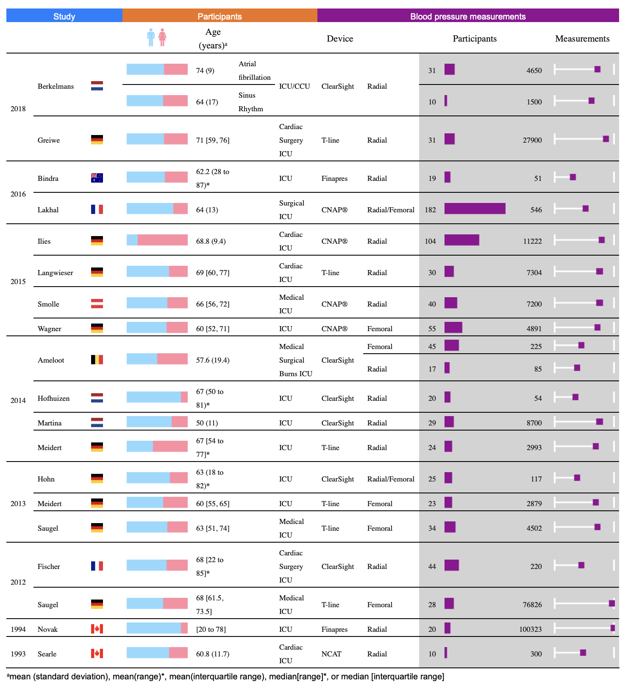

# Submission for Rstudio Table Contest 2020

This repo contains a submission for the [2020 Rstudio Table
Contest](https://blog.rstudio.com/2020/09/15/announcing-the-2020-rstudio-table-contest/).

This submission is an entry for the *static-print* category. Systematic
reviews are a type of academic publication, which involves the
identification, critical appraisal and synthesis of results from
multiple studies. It is very common in these types of static print
publications for a ‘summary’ of the characteristics of each study
included in the systematic review to be presented in the form of a table
consisting entirely of text. This submission demonstrates how the
[flextable](https://davidgohel.github.io/flextable/articles/overview.html)
package was used to replace some of the text with graphical features for
a study characteristics table. The printing of the table in landscape
format in the knitted word document was achieved using the
[officedown](https://davidgohel.github.io/officedown/) package. This
table format is highly customisable. An example of a published
static-print table using this same format, which we created for an
earlier publication, is available [here](https://rdcu.be/b4AoO). Some
features of the table include:

  - Use of a coloured inline ‘minibar’ images to show the male:female
    ratio in included studies
  - Images of flags (using
    [flagon](https://coolbutuseless.github.io/2020/04/03/introducing-flagon-a-package-of-just-flag-images-in-png-and-svg-format/))
    to indicate the country (in addition to being aesthetically more
    pleasing than presenting this information in text, this feature also
    reduced the amount of horizontal space required for this column,
    which is useful for static-print tables that need to be incorporated
    into Word documents).
  - Use of inline ‘minibar’ images so the reader can more quickly and
    clearly distinguish between studies that included higher numbers of
    participants than if the information was presented in text format

An [RStudio Cloud](https://rstudio.cloud/project/1821247) project is
available to demonstrate how flextable (and officedown) can be used to
produce the table in static-print format.

